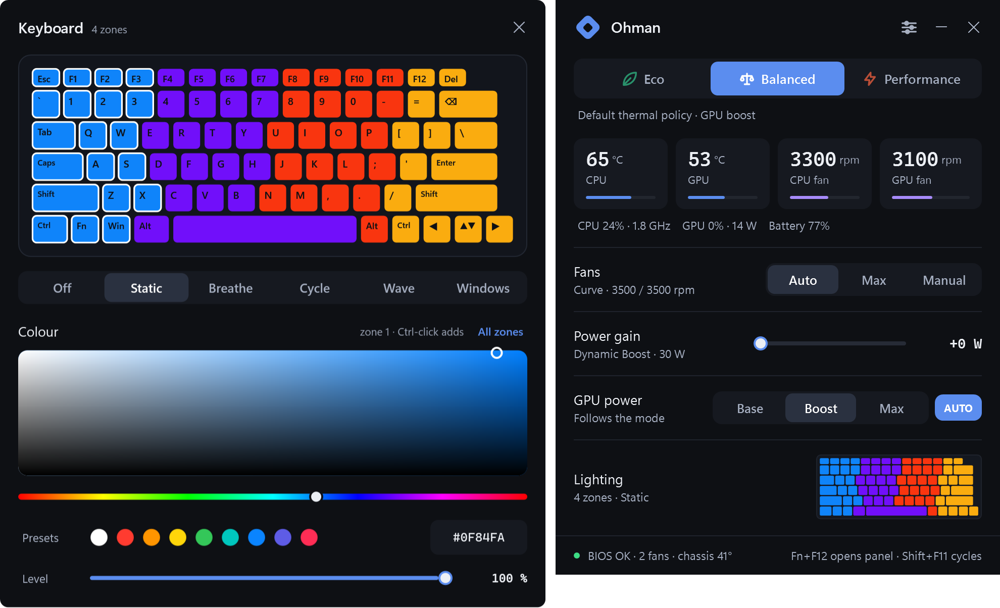

<p align="center"></p>
<h1 align="center">Ohman</h1>
<p align="center">OMEN Gaming Hub's performance controls, without OMEN Gaming Hub.</p>
<p align="center"><a href="https://github.com/P4R1H/Ohman/releases/latest/download/Ohman.exe"></a></p>

Don't you love paying $2,500 for a laptop and still having ads pushed down your throat by mandatory
software with no alternative? Ohman is the alternative. One executable, no services, no drivers, no account,
no ads. Same firmware interface as OMEN Gaming Hub, same bytes, nothing else.

**Verified on the HP OMEN Transcend 14 (2024, board 8C58).** Every other OMEN and Victus laptop runs in generic
mode: the mode bytes the Linux driver documents for its firmware generation, fan control with the same floor
and thermal guard, and power or GPU controls only where the firmware answers. A banner asks you to report
back so the board can be marked verified; see [Adding your laptop](#adding-your-laptop).

Ohman interacts with the BIOS through the same commands OGH uses. Use at your own risk.

<p align="center"></p>

## Features

| | |
|---|---|
| **Modes** | Eco · Balanced · Performance, one tap or Fn+F12. Eco also sets the Windows power mode and GPU base power, as OGH does. |
| **Fans** | Auto (OGH's own curve for this model, 1800 to 5700 rpm), Max, or Manual per fan. |
| **Power gain** | OGH's "Smart Performance Gain": +0 to +15 W on the CPU+GPU budget that NVIDIA Dynamic Boost draws from. |
| **GPU power** | Base · Boost · Max, or follow the mode. |
| **Per mode** | Fan, power gain and GPU choices are remembered per mode. |
| **Live** | CPU and GPU temperature, fan speeds, load, clocks, GPU watts, battery. |
| **OMEN key** | Fn+F12 opens the panel (or cycles modes, or toggles max fan). Shift+F11 cycles modes. OGH's key handler is stopped, reversibly. |
| **Safety** | A thermal guard forces max fan on a hot CPU, a hot chassis or stalled fans. Fans are never set below 1800 rpm. |
| **Lighting** | A live keyboard in the panel; click it and an editor slides open beside it: pick zones on the keyboard, a proper colour picker, presets, brightness, Breathe / Cycle / Wave effects, or hand the keyboard to Windows Dynamic Lighting. One-zone and four-zone keyboards; per-key editing is next. |
| **Extras** | Tray, hotkeys (Shift+F11 cycles modes, Ctrl+Alt+E/B/P/M/O), starts with Windows without a UAC prompt (on by default, one switch to turn off), Eco on battery, on-screen flash on key presses. |

Settings live in `ohman.state`, everything the app does goes to `ohman.log`.

<details>
<summary>Keyboard editor</summary>
<p align="center"></p>
</details>
<details>
<summary>Settings panel</summary>
<p align="center"></p>
</details>

## Install

Grab `Ohman.exe` from [Releases](../../releases), or build it with the compiler that ships inside Windows:

```
build.cmd
```

Run it (it asks for administrator rights once, the firmware interface needs them), then turn on
**Settings > Start with Windows**. `preview\Ohman.exe` is the same UI on simulated hardware, no admin needed.

## How it works

HP exposes a BIOS mailbox as the WMI class `hpqBIntM`. Ohman uses the commands OGH uses: performance mode
(`0x1A`), max fan (`0x27`), fan levels (`0x2E`), CPU+GPU power budget (`0x29`), GPU power (`0x22`), keyboard
lighting (`0x20009`), plus read-only queries. The OMEN key arrives as a WMI event (`hpqBEvnt`). The bytes and the measured firmware
behaviour are in [docs/research.md](docs/research.md).

## Adding your laptop

1. Run `tools\support-info.cmd` and press the OMEN key when it asks. It writes `tools\support-info.txt`:
   model, board id, BIOS, system-design data, fan table, key event. No personal data.
2. Open a **New laptop support** issue with that file, what OGH shows on your model, and ideally OGH's
   background log (`%LOCALAPPDATA%\Packages\AD2F1837.OMENCommandCenter_v10z8vjag6ke6\LocalCache\Local\HPOMEN\`)
   from a session where you clicked every mode.

A verified platform is one entry in `src/Platform.cs`; the board families and firmware probes behind generic
mode live in the same file. Nothing else is model-specific. The `add-laptop` skill in
`.claude/skills/` turns an issue into that entry and a pull request, see [CONTRIBUTING.md](CONTRIBUTING.md).

## Tools

| | |
|---|---|
| `tools\support-info.cmd` | data for a support request |
| `tools\verify.cmd` | read-only check of every query the app uses, plus a key-event capture |
| `tools\powertest.ps1` | A/B the power-gain slider on GPU watts and clocks |
| `tools\fantest.cmd` | firmware fan experiment. Holds the fans at zero for 60 s with an automatic abort; run it cool, idle and watching |
| `tools\omenprobe.cs` | CLI for raw BIOS calls |

## Layout

```
src\Platform.cs   platform profiles (the only model-specific file)
src\Hardware.cs   WMI/BIOS layer + simulated hardware
src\Lighting.cs   keyboard lighting (BIOS 0x20009) + Windows Dynamic Lighting hand-over
src\Engine.cs     apply logic, keep-alive, thermal guard, OMEN key, OGH takeover
src\Sensors.cs    perf counters + nvidia-smi
src\Ui.xaml, .cs  window, tray, hotkeys, on-screen flash
src\Program.cs    entry point
```

Pushing a `v*` tag builds the binaries on a Windows runner and attaches them to a release.

OMEN is a trademark of HP Inc. This project is not affiliated with HP.
