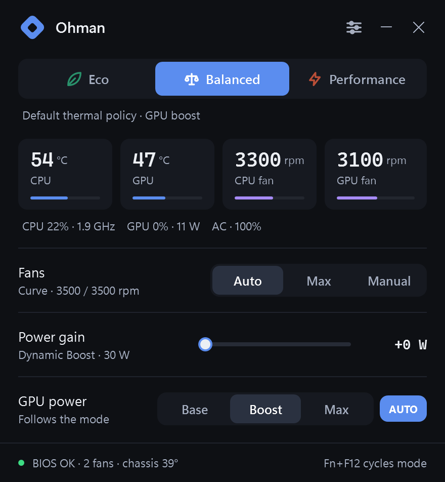
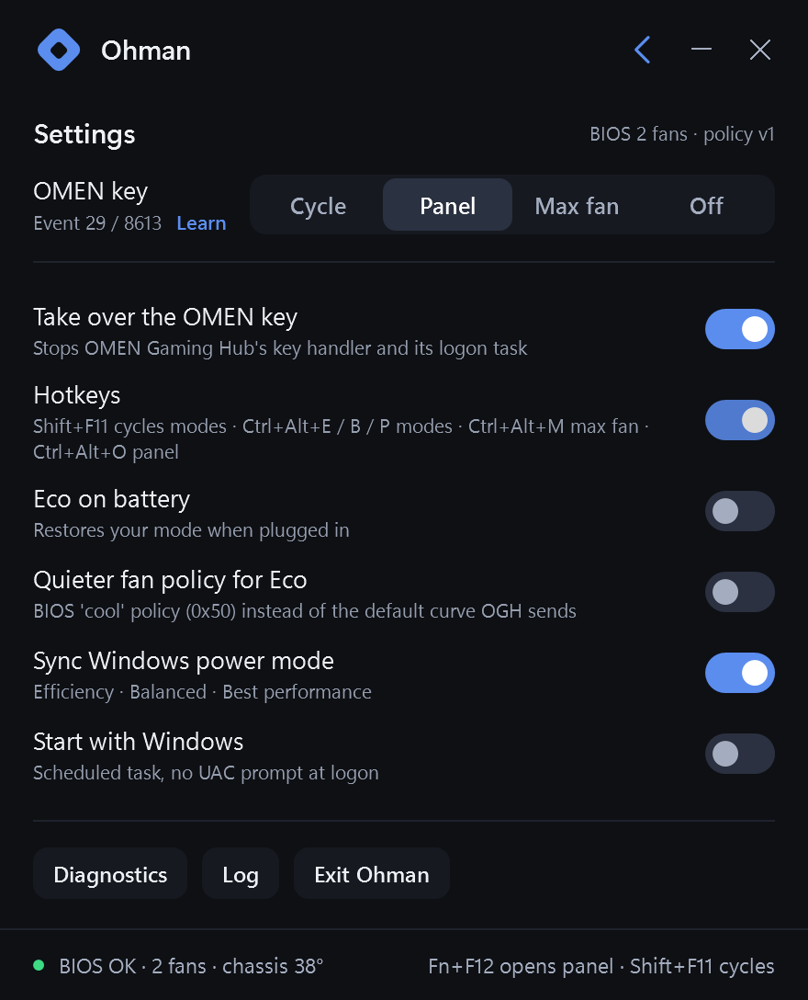

# Ohman

A small, honest replacement for OMEN Gaming Hub's performance controls. One executable, no services, no
drivers, no account, no ads. It speaks to the laptop's firmware through the same WMI interface OMEN Gaming
Hub uses, sends the same bytes OGH sends, and nothing it hasn't been verified to send.

**Built for the HP OMEN Transcend 14 (2024, board 8C58).** The goal is every OMEN and Victus laptop;
the method is one verified platform profile at a time. See [Adding your laptop](#adding-your-laptop).

Ohman talks to fan and power firmware directly. It is tested on one machine by one person; use it at your
own risk and keep an eye on temperatures the first time you run it.

<p align="center"></p>

## What you get

| | |
|---|---|
| **Modes** | Eco · Balanced · Performance, one tap or Fn+F12. Eco also switches the Windows power mode and drops GPU power, exactly as OGH does. |
| **Fans** | Auto runs OGH's own fan curve for this model (CPU, GPU and chassis sensors, 1800–5700 rpm), or Max, or Manual with a slider per fan. |
| **Power gain** | OGH's "Smart Performance Gain": +0 … +15 W on the shared CPU+GPU budget that NVIDIA Dynamic Boost draws from. |
| **GPU power** | Base · Boost · Max (what OGH sets behind the scenes per mode), or Auto to follow the mode. |
| **Per mode** | Fan, power gain and GPU choices are remembered per mode, like tabs. |
| **Live** | CPU and GPU temperature, both fan speeds, load, clocks, GPU watts, battery. |
| **OMEN key** | Fn+F12 becomes yours: it opens the panel (or cycles modes, or toggles max fan, your pick). OGH's launcher is stopped and its logon task disabled (reversible). |
| **Safety** | A thermal guard forces max fan when the CPU is hot, the chassis sensor is hot, or the fans read stalled. Fans can never be set below 1800 rpm. Unknown laptops run read-only. |
| **Extras** | Tray menu, hotkeys (Shift+F11 cycles modes, Ctrl+Alt+E/B/P/M/O), start-with-Windows without a UAC prompt, Eco on battery, on-screen flash on key presses. |

Settings live in `ohman.state` (plain text) and everything the app does goes to `ohman.log`.

<details>
<summary>Settings panel</summary>
<p align="center"></p>
</details>

## Install

Download `Ohman.exe` from the [Releases](../../releases) page, put it in a folder of its own, run it. It asks
for administrator rights once because the firmware interface is admin-only. Or build it yourself with the
compiler that ships inside Windows:

```
build.cmd
```

That gives you `Ohman.exe` (the real thing) and `preview\Ohman.exe` (same UI, simulated hardware, no admin,
for looking around).

Turn on **Settings → Start with Windows** so it comes back at logon, hidden, without prompting. If OMEN
Gaming Hub is installed it can stay installed; Ohman only stops its key handler.

From PowerShell:

```powershell
Start-Process -FilePath ".\Ohman.exe" -Verb RunAs
```

## How it works, in one paragraph

HP exposes a BIOS mailbox as the WMI class `hpqBIntM` (`root\wmi`). Every command is a small byte payload
with a command type. Ohman uses the ones OGH uses: set performance mode (`0x1A`), max fan (`0x27`), fan
levels (`0x2E`), CPU+GPU power budget (`0x29`), GPU power (`0x22`), plus read-only queries for fan speed,
the chassis sensor and the fan table. The OMEN key arrives as a WMI event (`hpqBEvnt`). The exact bytes and
the measured firmware behaviour are in [docs/research.md](docs/research.md).

## Adding your laptop

Ohman refuses to write to a board it hasn't been verified on. To add yours:

1. Run `tools\support-info.cmd` (accept the UAC prompt, press the OMEN key when it asks). It writes
   `tools\support-info.txt` with model, board id, BIOS version, the firmware's system-design data, fan
   table and key event. No personal data is collected.
2. Open a **New laptop support** issue and paste the file, plus what OGH shows on your model (mode names,
   fan options, power sliders).
3. If you can, attach OGH's background log from a session where you clicked through every mode
   (`%LOCALAPPDATA%\Packages\AD2F1837.OMENCommandCenter_v10z8vjag6ke6\LocalCache\Local\HPOMEN\`).
   Its `inputData=` lines are the ground truth for the bytes your firmware expects.

A platform is a single entry in `src/Platform.cs`: board ids, mode bytes, fan curve and bounds, power budget
and GPU payloads. Nothing else in the code is model-specific. The `add-laptop` skill in `.claude/skills/`
turns a support issue into that entry and a pull request with the evidence; see [CONTRIBUTING.md](CONTRIBUTING.md).

## Safety notes

- Fan control is real. The app drives the fans explicitly in every mode (Auto is OGH's own curve), never
  writes below 1800 rpm, refreshes the firmware keep-alive every 30 s, and runs a thermal guard from the
  first ten seconds. The firmware semantics behind these rules are documented in
  [docs/research.md](docs/research.md#4-fan-control).
- `tools\fantest.cmd` deliberately holds the fans at zero for 60 seconds with an automatic abort, to
  measure firmware behaviour. Run it only cool, idle, and watching.
- Unsupported laptops run read-only. Don't add your board to the profile list without the issue workflow
  above; the mode bytes differ between firmware generations.

## Tools

| | |
|---|---|
| `tools\support-info.cmd` | collect the data for a support request (no PII) |
| `tools\verify.cmd` | read-only sanity check of every query the app uses, plus a 15 s key-event capture |
| `tools\powertest.ps1` | A/B the power-gain slider: samples GPU watts and clocks for a minute |
| `tools\fantest.cmd` | bounded firmware experiment for fan semantics (see safety notes) |
| `tools\omenprobe.cs` | tiny CLI for raw BIOS calls, used by the scripts |

## Layout

```
src\Platform.cs   platform profiles (the only model-specific file)
src\Hardware.cs   WMI/BIOS layer + simulated hardware
src\Engine.cs     settings, apply logic, keep-alive, thermal guard, OMEN key, OGH takeover
src\Sensors.cs    perf counters + nvidia-smi
src\Ui.xaml       layout and styles (embedded)
src\Ui.cs         window, tray, hotkeys, on-screen flash
src\Program.cs    entry point
docs\             interface documentation
```

## Releases

Pushing a tag like `v2.1` builds `Ohman.exe`, `preview\Ohman.exe` and `tools\omenprobe.exe` on a Windows
runner and attaches them to a GitHub release (`.github/workflows/release.yml`).

OMEN is a trademark of HP Inc. This project is not affiliated with HP.
